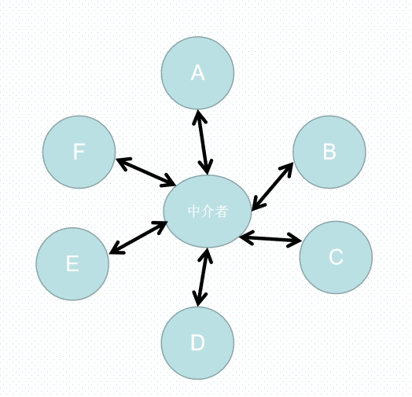

# 中介者模式的定义

在我们生活的世界中，每个人每个物体都会产生一些错综复杂的联系，在应用程序里也是一样，所有对象都按照某种关系和规则来通信

在程序里，也许一个对象会和其他10个对象打交道，当程序的规模增大，对象会越来越多，关系会越来越复杂。当我们想改变或者删除的时候，必须小心翼翼，很容易出问题

# 作用

解除对象与对象之间的紧耦合关系。增加一个中介者对象后，所有的对象都通过中介者对象来通信，而不是相互引用，所以当一个对象发生改变时，只需要通知中介者对象即可。

中介者对象使网状的多对多关系变成了相对简单的一对多关系



看上图，如果对象A发生了改变，则需要同时通知其他所有对象

# 现实生活的例子

1. 机场指挥塔

中介者也被称为调停者，我们想象一下机场的指挥塔，如果没有指挥塔的存在，每一架飞机要和方圆100公里内的所有飞机通信，才能确认航线以及飞行情况，后果是不可想象的。

现实中的情况是，每架飞机都只需要和指挥塔通信。从而知道飞行情况

2. 菠菜公司

在世界杯期间购买足球彩票，如果没有菠菜公司作为中介，上千位的人一起计算赔率和输赢绝对是不可能实现的事情。有了菠菜公司作为中介，每个人只需要和菠菜公司发生关系，菠菜公司会根据所有人的投注情况计算和赔率，彩民们赢钱就从菠菜公司拿，输了钱就交给菠菜公司

# 例子——泡泡堂游戏

假如玩家的数目为2，所以当其中一个玩家死亡的时候游戏结束，同时通知队友胜利。

```JS

function Player(name) {
    this.name = name
    this.enemy = null // 敌人
}

Player.prototype.win = function() {
    console.log(`${this.name}win`)
}

Player.prototype.lose = function() {
    console.log(`${this.name}lose`)
}

Player.prototype.die = function() {
    this.lose()
    this.enemy.win()
}
```

接下来创建2个游戏对象：

```js
const player1 = new Player('皮蛋')
const player2 = new Player('鸭子')
```

给玩家相互设置敌人

```js
player1.enemy = player2
player2.enemy = player1
```

当玩家1被泡泡炸死的时候，只需要调用这一句代码即可

```JS
player1.die() // 输出：皮蛋lose、鸭子win
```

## 增加队伍(不用中介者模式)

现在我们改进一下游戏。把玩家数量变为8个，用下面的方式设置队友和敌人无疑很低效

```js
player1.partners = [player1, player2, player3, player4]
player1.enemies = [player5, player6, player7, player8]

player5.partners = [player5, player6, player7, player8]
player5.enemies = [player1, player2, player3, player4]
```

接下来，让我们看看正常的代码

[增加队伍.js](./增加队伍.js)


### 玩家过多带来的困扰

现在我们已经可以随意增加玩家或者队伍，但问题是，每个玩家和其他玩家都是紧密耦合的。

在这个例子中只创建了8个玩家，而如果在一个大型网游里，画面里有成百上千个玩家，几十支队伍互相厮杀，如果有一个玩家掉线，必须从所有其他玩家的队友列表中都移除这个玩家。游戏也许还有解除队伍和添加到别的队伍的功能，红色玩家可以突然变成蓝色玩家，这就不仅仅是循环能够解决的问题了。面对这样的需求，我们上面的代码可就差强人意了。

## 用中介者模式改造泡泡堂游戏

[中介者模式版泡泡堂](./中介者模式版泡泡堂.js)


# 中介者模式的缺点

最大的缺点是系统中会新增一个中介者对象，因为对象之间交互的复杂性，转移成了中介者对象的复杂性，使得中介者对象经常是巨大的。中介者对象自身往往是一个难以维护的对象

# 其他文章

1. [单例模式](1.单例模式/readme.md)
2. [策略模式](2.策略模式/readme.md)
3. [代理模式](3.代理模式/readme.md)
4. [迭代器模式](4.迭代器模式/readme.md)
5. [发布-订阅模式](5.发布-订阅模式/readme.md)
6. [命令模式](6.命令模式/readme.md)
7. [组合模式](7.组合模式/readme.md)
8. [模板模式](8.模板模式/readme.md)
9. [享元模式](9.享元模式/readme.md)
10. [职责链模式](10.职责链模式/readme.md)
11. [中介者模式](11.中介者模式/readme.md)
12. [装饰者模式](12.装饰者模式(重点)/readme.md)
13. [状态模式](13.状态模式/readme.md)
14. [适配器模式](14.适配器模式/readme.md)
15. [外归模式](17.外观模式/readme.md)
16. [单一职责原则](15.单一职责原则/readme.md)
17. [最小知识原则](16.最小知识原则/readme.md)
18. [开放-封闭原则](18.开放-封闭原则/readme.md)
19. [代码重构](19.代码重构/readme.md)